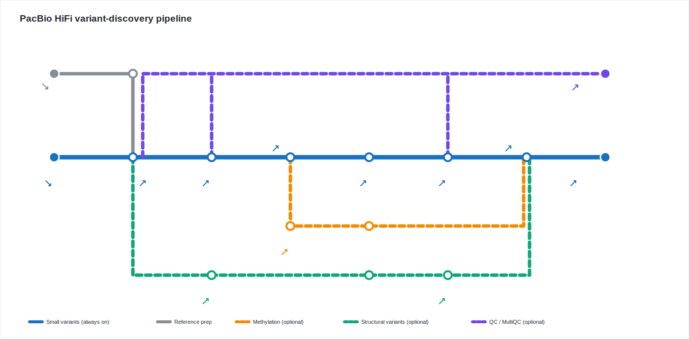
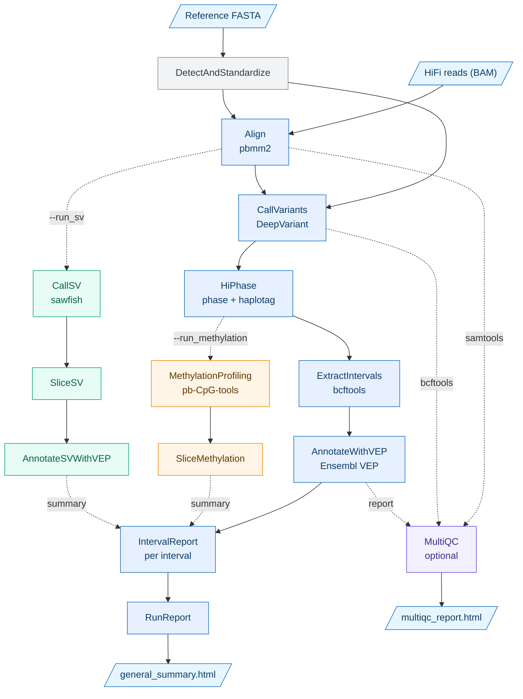

# Variant discovery pipeline for PacBio HiFi long reads

[](https://www.nextflow.io/)
[](https://www.nextflow.io/docs/latest/dsl2.html)
[](#requirements)

> **Targeted long-read variant discovery for any species** — align, call, phase, annotate, and report,
> from a simple CSV samplesheet to interactive HTML reports.

A **Nextflow (DSL2)** pipeline that takes **PacBio HiFi** long reads and discovers, phases, and annotates
variants inside one or more user-specified genomic intervals. It is built primarily for **non-human**
genomes (cattle, `bos_taurus` / `ARS-UCD2.0`, by default) and is fully parameterized for any species through
a VEP cache or a GFF annotation file.

For each sample the pipeline aligns the reads, calls small variants (SNVs/indels), phases them, slices the
target interval(s), annotates them with Ensembl VEP, and produces rich, self-contained **HTML reports**.
Two optional rails add **CpG methylation profiling** and **structural-variant (SV) calling + annotation**.

### Key features

- **Long-read SNV/indel calling** with DeepVariant, plus **always-on phasing** (HiPhase) and haplotagging.
- **Interval-targeted** — focus compute and reporting on the exact region(s) you care about.
- **Species-agnostic** — any genome through a VEP cache *or* a GFF file (cattle is only the default).
- **Optional structural variants** (sawfish, VEP-annotated) and **CpG methylation** (pb-CpG-tools).
- **Self-contained interactive HTML reports** per interval + a run-level summary, and a global **MultiQC**.
- **Portable & reproducible** — composable Singularity / Docker / Conda × SLURM / local profiles; every step
  runs in a **version-pinned container**, so there are no manual tool installs.

---

## Table of contents

- [Pipeline summary](#pipeline-summary)
- [Workflow diagram](#workflow-diagram)
- [Requirements](#requirements)
- [Quick start](#quick-start)
- [Usage](#usage)
  - [Input: the samplesheet](#input-the-samplesheet)
  - [Interactive mode (`run.sh`)](#interactive-mode-runsh)
  - [Direct `nextflow run`](#direct-nextflow-run)
- [Execution profiles & Singularity cache](#execution-profiles--singularity-cache)
- [Resource allocation](#resource-allocation)
- [VEP annotation: cache mode vs GFF mode](#vep-annotation-cache-mode-vs-gff-mode)
- [Optional features](#optional-features)
- [Parameters](#parameters)
- [Outputs](#outputs)
- [Customising for another species](#customising-for-another-species)
- [Cleanup](#cleanup)
- [Tips & troubleshooting](#tips--troubleshooting)
- [Credits & tool references](#credits--tool-references)
- [Citation](#citation)
- [License](#license)

---

## Pipeline summary

For every sample, the pipeline runs the following steps. Steps 1–9 always run; steps marked *(opt-in)* run
only when requested.

1. **Reference standardization** (`DetectAndStandardize`) — auto-detects Ensembl-style (`1, 2, X, MT…`) vs
   NCBI-style (`NC_*` accessions) chromosome naming, rewrites the FASTA headers to simple names, indexes it
   with `samtools faidx`, and extracts the chromosome list used to restrict variant calling. Runs **once**
   and is shared by all samples.
2. **Alignment** (`Align`) — maps HiFi reads to the standardized reference with **pbmm2** (PacBio's minimap2
   wrapper) → sorted, indexed BAM.
3. **Variant calling** (`CallVariants`) — calls SNVs/indels with **DeepVariant** (`PACBIO` model), restricted
   to the detected chromosomes. Also emits DeepVariant's visual QC report.
4. **Phasing** (`HiPhase`, always on) — phases the variants and haplotags the BAM (`HP`/`PS` tags). The
   phased VCF (`0|1`) feeds the downstream interval/annotation path; the haplotagged BAM feeds the optional
   methylation rail.
5. **Interval extraction** (`ExtractIntervals`) — slices the phased VCF down to each requested
   `chromosome:start-end` with `bcftools view -r`.
6. **VEP annotation** (`AnnotateWithVEP`) — annotates the interval VCF with **Ensembl VEP**, in either
   **cache mode** or **GFF mode** (see [VEP annotation](#vep-annotation-cache-mode-vs-gff-mode)).
7. **Methylation profiling** *(opt-in, `--run_methylation`)* (`MethylationProfiling` + `SliceMethylation`) —
   extracts 5mC CpG scores from the HiFi `MM`/`ML` tags with **pb-CpG-tools**, producing combined +
   haplotype-specific (hap1/hap2) tracks, sliced per interval. Summary embedded in the HTML report.
8. **Structural variant calling** *(opt-in, `--run_sv`)* (`CallSV` + `SliceSV` + `AnnotateSVWithVEP`) — calls
   germline SVs (DEL/INS/DUP/INV/BND) genome-wide with **sawfish**, slices them to each interval with overlap
   semantics, and annotates them with VEP (same gene model as the SNV path). Summary embedded in the report.
9. **Reporting** (`IntervalReport` + `RunReport`) — a self-contained HTML report **per (sample × interval)**
   (variants with full VEP annotation, plus the SV and methylation summaries when enabled), and one
   **run-level `general_summary.html`** aggregating every interval.
10. **Quality control** (`SamtoolsStats`, `BcftoolsStats`, `MultiQC`; skip with `--skip_multiqc`) — gathers
    alignment, variant, and VEP QC into a **single global MultiQC report** across all samples.

---

## Workflow diagram



*Solid lines are the always-on path; **dashed lines are optional steps** (methylation `--run_methylation`,
structural variants `--run_sv`, QC `--skip_multiqc`). Small arrows mark files — **↘ what you provide**,
**↗ what you receive** in the results folder (BAM, VCF, BED, HTML…).*

<details>
<summary>Show the same flow as a text-based (Mermaid) diagram</summary>



*Node colours match the metro map — blue = always-on core, grey = reference prep, orange = methylation
(`--run_methylation`), green = structural variants (`--run_sv`), purple = MultiQC (optional, `--skip_multiqc`).
Rounded boxes are the files you provide / receive; dotted edges are the opt-in rails and the QC inputs
(MultiQC reads the alignment, the variant calls, and the VEP report).*

</details>

---

## Requirements

- **[Nextflow](https://www.nextflow.io/) ≥ 24.04.0** (the workflow uses the DSL2 `output {}` block).
- **Java 17+** (required by Nextflow).
- **One container engine** — the pipeline pulls all tool images automatically; you only choose the engine:
  - **Singularity / Apptainer** (recommended on HPC clusters), or
  - **Docker** (workstation), or
  - **Conda**.
- **Inputs:**
  - One or more **PacBio HiFi BAM** files (with `MM`/`ML` tags if you want methylation).
  - A **reference FASTA** (Ensembl-style `1, 2, X, MT…` or NCBI-style `NC_*`; both are auto-detected).
  - **Either** a **VEP cache** directory **or** a **GFF** annotation file.
- A **scheduler** is optional: the `hpc2n` site profile targets **SLURM**; the `local`/`standard` profiles run
  on the current machine.

No tool needs to be installed by hand — every step runs inside a pinned container.

---

## Quick start

```bash
git clone <your-repo-url>
cd <repo>

# Interactive launcher (prompts for every input, then runs Nextflow):
bash run.sh
```

`run.sh` asks for each input in turn; defaults are shown in brackets — press **Enter** to accept. It builds
the `nextflow run` command for you and (optionally) cleans the work cache afterwards.

Prefer to drive Nextflow yourself? See [Direct `nextflow run`](#direct-nextflow-run).

---

## Usage

### Input: the samplesheet

The pipeline is **multi-sample**. `--input` is a **CSV samplesheet** with a header and four columns:

```csv
sample,bam,chromosome,interval
COW_001,/data/COW_001.hifi.bam,2,6279000-6280000
COW_001,/data/COW_001.hifi.bam,26,14404993-14405000
COW_002,/data/COW_002.hifi.bam,26,14404993-14405000
```

| Column       | Description                                                                              |
|--------------|------------------------------------------------------------------------------------------|
| `sample`     | Sample name. Used to prefix every output file; reused across rows of the same sample.    |
| `bam`        | **Absolute** path to the PacBio HiFi BAM (`file()` does not expand `~`).                  |
| `chromosome` | Chromosome of the target interval, in **standardized** naming (e.g. `2`, `26`, `X`).     |
| `interval`   | `START-END` coordinates on that chromosome (1-based, e.g. `14404993-14405000`).          |

Rules:

- **One row per `(sample, interval)`.** To analyze several intervals of the same sample, repeat the row with
  the same `sample` + `bam` and a different `chromosome`/`interval`.
- A sample appearing on multiple rows is **aligned and variant-called only once**; the analysis then fans out
  to each interval.
- Empty fields are rejected with an explicit error.

### Interactive mode (`run.sh`)

`run.sh` supports two entry points:

- **1 sample** — fully interactive: enter the sample name, BAM, and interval(s); the script generates the
  samplesheet for you.
- **2+ samples** — provide the path to an existing samplesheet CSV (the format above).

It then prompts for the reference, the VEP source (cache or GFF), species/assembly, output directory, **run
name**, optional per-tool extra arguments, the optional rails (methylation, SV, MultiQC, Nextflow execution
reports), and the execution environment (engine, site, SLURM account, Singularity cache, resource tier).

> The **execution-environment answers** (engine, site, SLURM account, Singularity cache, resource tier) are
> saved to `run_profile.conf` next to `run.sh` on first run and reused afterwards — it shows them and only
> asks *"Reconfigure? (y/n)"*. Delete the file to reset. Per-run inputs (sample, reference, intervals, run
> name, VEP source) are never stored and stay interactive.

### Direct `nextflow run`

```bash
nextflow run find_specific_mutation.nf \
  -profile        singularity,hpc2n \
  --input         samplesheet.csv \
  --reference     /data/ARS-UCD2.0.fa \
  --vep_cache     /data/vep_cache \
  --vep_species   bos_taurus \
  --vep_assembly  ARS-UCD2.0 \
  --outdir        Results \
  --run_name      run_2026_06_04 \
  --run_methylation true \
  --run_sv          true \
  --slurm_account proj2025-1-23
```

Use `--vep_gff /path/to/annotation.gff.gz` instead of `--vep_cache` for GFF mode. Omit `--slurm_account` to
let SLURM use your default account; omit `-profile` to run locally (`standard`).

---

## Execution profiles & Singularity cache

Profiles are **composable**: choose **one container engine** and **one compute site**, comma-separated
(`-profile <engine>,<site>`). Any combination works.

| Profile        | Type    | Effect                                                                              |
|----------------|---------|-------------------------------------------------------------------------------------|
| `singularity`  | engine  | Singularity/Apptainer; `cacheDir` = `$NXF_SINGULARITY_CACHEDIR` (see below).         |
| `docker`       | engine  | Docker (workstation).                                                               |
| `conda`        | engine  | Conda environments.                                                                 |
| `hpc2n`        | site    | SLURM executor; passes `-A <account>` only when `--slurm_account` is set.            |
| `local`        | site    | Runs on the current machine.                                                        |
| `standard`     | site    | Runs on the current machine; **auto-applied when `-profile` is omitted**.            |

Examples: `-profile singularity,hpc2n` (cluster), `-profile docker,local` (workstation). `run.sh` prompts for
both. **No site, account, or cache path is hard-coded** — they all come from the profile / parameters / env.

### Sharing the Singularity image cache (clusters)

On a shared cluster, export `NXF_SINGULARITY_CACHEDIR` to a shared location **before** launching, so the
container images are downloaded once and reused across runs:

```bash
# This session only:
export NXF_SINGULARITY_CACHEDIR=/path/to/shared/singularity/cache

# Make it permanent:
echo 'export NXF_SINGULARITY_CACHEDIR=/path/to/shared/singularity/cache' >> ~/.bashrc
source ~/.bashrc

# Verify:
echo "$NXF_SINGULARITY_CACHEDIR"
```

If it is unset, the cache falls back to `${projectDir}/.singularity_cache` (works, but re-downloads per
clone). When you launch through `run.sh`, the Singularity cache path you enter is stored in `run_profile.conf`
and **exported automatically** — so `~/.bashrc` is not required in that case.

---

## Resource allocation

Most processes have **fixed** CPU/memory/time in `nextflow.config`. Only the **two heavy processes**,
`CallVariants` (DeepVariant) and `CallSV` (sawfish), are tunable, through a **resource tier** chosen in
`run.sh`:

| Tier             | CallVariants     | CallSV           |
|------------------|------------------|------------------|
| **Normal** (default) | 36 cpu / 120 GB | 36 cpu / 160 GB |
| **High**         | 48 cpu / 160 GB  | 48 cpu / 200 GB  |
| **Very High**    | 60 cpu / 200 GB  | 60 cpu / 240 GB  |
| **Custom**       | user (≥ 36 cpu / ≥ 160 GB) | same   |

The tier sets `--callvariants_cpus` / `--callvariants_memory` / `--callsv_cpus` / `--callsv_memory`. **Time is
never changed.**

The allocation is deliberately **fixed** (no automatic scaling). On a shared cluster, requesting bigger nodes
(High / Very High) often means **waiting longer in the queue** for a large node to free up, so smaller nodes
frequently finish sooner overall. Bump the tier only if large nodes are readily available on your cluster.
Make sure your cluster can actually provide the cpu/RAM of the chosen tier — `run.sh` displays each tier's
requirements and warns about the queue trade-off.

The SLURM account is set with `--slurm_account <account>` (e.g. `proj2025-1-23`) or the `run.sh` prompt; leave
it unset to use your cluster's default account.

---

## VEP annotation: cache mode vs GFF mode

Annotation source is selected by `--vep_cache <dir>` **xor** `--vep_gff <file>` (mutual exclusivity is
enforced by `run.sh`). `--vep_species` (default `bos_taurus`) and `--vep_assembly` (default `ARS-UCD2.0`) are
passed to VEP in both modes.

**Cache mode (`--vep_cache`)** — recommended whenever a pre-built VEP cache exists for your species. You get
full annotations, including SIFT scores, gene–phenotype links, and regulatory features
(`--sift --gene_phenotype --regulatory`).

**GFF mode (`--vep_gff`)** — the fallback for species without an Ensembl cache. The pipeline accepts **any**
GFF (plain text, gzip, or bgzip): it is automatically stripped of comments, sorted by chromosome/start/end,
re-bgzipped, and tabix-indexed inside the work directory before being handed to VEP. In GFF mode the
cache-only features are **disabled automatically** because they need pre-computed cache data:

- `--sift` (SIFT pathogenicity prediction)
- `--gene_phenotype` (gene–phenotype associations)
- `--regulatory` (Ensembl regulatory features)

Core consequence calling plus `--symbol`, `--canonical`, and `--biotype` still work (provided the GFF declares
them).

---

## Optional features

| Feature                | Flag                | Tool          | What it adds                                                                 |
|------------------------|---------------------|---------------|------------------------------------------------------------------------------|
| **Methylation**        | `--run_methylation` | pb-CpG-tools  | Combined + haplotype-specific (hap1/hap2) 5mC CpG tracks, sliced per interval, summarized in the HTML report. Requires `MM`/`ML` tags in the BAM (gracefully skipped if absent). |
| **Structural variants**| `--run_sv`          | sawfish + VEP | Genome-wide germline SVs (DEL/INS/DUP/INV/BND), sliced to each interval (overlap), VEP-annotated with gene/consequence, summarized in the HTML report. |
| **Global MultiQC**     | on by default       | MultiQC       | One report aggregating alignment, variant, SV, and VEP QC across all samples. Disable with `--skip_multiqc`. |

Both optional rails are **additive** and their per-interval summaries are embedded into the same HTML report,
so a reader sees SNVs, SVs, and methylation for an interval in one place.

---

## Parameters

| Parameter               | Required | Default        | Description                                                                 |
|-------------------------|----------|----------------|-----------------------------------------------------------------------------|
| `--input`               | yes      | —              | CSV samplesheet (`sample,bam,chromosome,interval`).                         |
| `--reference`           | yes      | —              | Reference FASTA (Ensembl or NCBI naming, auto-detected).                    |
| `--outdir`              | no       | `Results`      | Base output directory.                                                      |
| `--run_name`            | no       | `null`         | Group results under `<outdir>/<run_name>/` (one self-contained folder/run). |
| `--vep_cache`           | one of   | `null`         | Path to a VEP cache directory (full annotations).                          |
| `--vep_gff`             | the two  | `null`         | Path to a GFF (any compression; re-indexed internally).                    |
| `--vep_species`         | no       | `bos_taurus`   | VEP `--species`.                                                            |
| `--vep_assembly`        | no       | `ARS-UCD2.0`   | VEP `--assembly`.                                                           |
| `--run_methylation`     | no       | `false`        | Enable CpG methylation profiling (pb-CpG-tools).                           |
| `--run_sv`              | no       | `false`        | Enable structural-variant calling + annotation (sawfish + VEP).            |
| `--skip_multiqc`        | no       | `false`        | Skip the global MultiQC report.                                            |
| `--callvariants_cpus`   | no       | `36`           | CPUs for DeepVariant (set by the resource tier).                          |
| `--callvariants_memory` | no       | `120.GB`       | RAM for DeepVariant.                                                        |
| `--callsv_cpus`         | no       | `36`           | CPUs for sawfish.                                                           |
| `--callsv_memory`       | no       | `160.GB`       | RAM for sawfish.                                                            |
| `--slurm_account`       | no       | `null`         | SLURM `-A` account for the `hpc2n` profile (e.g. `proj2025-1-23`).          |
| `--align_args`          | no       | `''`           | Extra args appended to the pbmm2 command.                                  |
| `--deepvariant_args`    | no       | `''`           | Extra args appended to the DeepVariant command.                            |
| `--vep_args`            | no       | `''`           | Extra args appended to the VEP command.                                    |
| `-profile`              | no       | `standard`     | Composable Nextflow profiles, `<engine>,<site>` (Nextflow core option).    |

\* Provide **either** `--vep_cache` **or** `--vep_gff`, never both. `run.sh` enforces this.

---

## Outputs

All results land under **`<outdir>/<run_name>/`** (or directly under `<outdir>/` when `--run_name` is unset).
Everything is published in **`copy`** mode, so the results survive `nextflow clean`.

```
<outdir>/<run_name>/
├── <sample>/
│   ├── alignment/
│   │   └── <sample>.aligned.bam (+ .bai)
│   ├── variant_calling/
│   │   ├── <sample>.variants.vcf.gz                  # raw DeepVariant calls
│   │   └── <sample>.variants.visual_report.html      # DeepVariant QC
│   ├── phasing/
│   │   ├── <sample>.phased.vcf.gz (+ .tbi)
│   │   ├── <sample>.haplotagged.bam (+ .bai)         # HP/PS tags
│   │   └── <sample>.phase_{stats,summary,blocks}.tsv
│   ├── intervals/
│   │   └── <sample>_interval_chr<chrom>_<interval>.vcf.gz (+ .tbi)   # pre-annotation slice
│   ├── vep_annotated/
│   │   └── <sample>_interval_chr<chrom>_<interval>_annotated.vcf.gz (+ .tbi)
│   ├── methylation/            # only with --run_methylation
│   │   ├── <sample>.{combined,hap1,hap2}.bed.gz (+ .bw)
│   │   └── <sample>_<...>_chr<chrom>_<interval>...  # per-interval sliced BEDs
│   ├── sv/                     # only with --run_sv
│   │   ├── <sample>.sv.vcf.gz                        # genome-wide SV calls
│   │   └── <sample>_sv_annotated_chr<chrom>_<interval>.vcf.gz (+ .tbi)
│   └── <sample>_report_chr<chrom>_<interval>.html    # per-(sample × interval) HTML report
├── general_summary.html        # run-level aggregated report (all intervals)
├── multiqc_report.html         # global MultiQC (unless --skip_multiqc)
├── samplesheet.csv             # written by run.sh in single-sample mode
└── pipeline_info/              # Nextflow report/timeline/trace/dag (if enabled in run.sh)
```

### The reports

- **Per-interval HTML** (`<sample>/<sample>_report_chr<chrom>_<interval>.html`) — every variant of the
  interval with its VEP annotation (consequence, IMPACT, gene/symbol, transcript, HGVS, etc.), plus the SV
  table and methylation table when those rails are enabled. Tables are collapsible, paginated, and searchable
  (AND search).
- **Run-level `general_summary.html`** — a single page aggregating every `(sample × interval)` report behind
  a clickable table of contents.
- **`multiqc_report.html`** — alignment (samtools stats), variant (bcftools stats on SNVs and, if enabled,
  SVs), and VEP summary statistics for all samples in one report.

---

## Customising for another species

1. Set `--vep_species` and `--vep_assembly` (or accept the `run.sh` prompts).
2. Provide the matching annotation:
   - a **VEP cache** (download from Ensembl:
     `https://ftp.ensembl.org/pub/release-<version>/variation/indexed_vep_cache/`), **or**
   - a **GFF** file (GFF mode prepares and indexes it for you).
3. If your species uses non-standard chromosome names (e.g. `chr1`, scaffolds), check the chromosome regex
   `[0-9]+|X|Y|Z|W|MT` in `modules/detect_and_standardize.nf` — it may need extending.

---

## Cleanup

`run.sh` offers a post-run cleanup. If you answer `y` to *"Clean Nextflow work cache after completion?"*, it
runs `nextflow clean -f last` after a successful finish. This removes **only** that run's Nextflow work
directory — published results (`copy` mode), VEP caches, GFF files, and any other external inputs are
untouched. The cleanup uses `nextflow clean` (never `deleteDir()`), so a symlinked VEP cache is never
followed/wiped.

---

## Tips & troubleshooting

- **BAM paths must be absolute** in the samplesheet — Nextflow's `file()` does not expand `~`.
- **A changed process signature invalidates `-resume`.** Editing a process means Nextflow re-runs it (the old
  cache no longer matches); expect a full rerun after code changes.
- **Inspect the assembled command** for any step in `work/<hash>/.command.sh`, and runtime behavior in
  `.command.out` / `.command.err` — especially useful for VEP/GFF debugging.
- **DeepVariant only processed one chromosome?** The `--regions` list is passed as a single quoted value via a
  bash array on purpose; do not "simplify" it to an unquoted variable, or it word-splits and only the first
  chromosome is processed.
- **Methylation produced nothing?** The HiFi BAM has no `MM`/`ML` tags. The rail is skipped gracefully and the
  report shows a "no methylation" note.

---

## Credits & tool references

This pipeline was developed as a thesis project. It orchestrates the following open-source tools — please
cite the underlying tools when you publish results produced with this pipeline:

- [Nextflow](https://www.nextflow.io/) — workflow engine
- [pbmm2](https://github.com/PacificBiosciences/pbmm2) — HiFi alignment (minimap2)
- [DeepVariant](https://github.com/google/deepvariant) — small-variant calling
- [HiPhase](https://github.com/PacificBiosciences/HiPhase) — phasing & haplotagging
- [Ensembl VEP](https://www.ensembl.org/vep) — variant annotation
- [pb-CpG-tools](https://github.com/PacificBiosciences/pb-CpG-tools) — CpG methylation
- [sawfish](https://github.com/PacificBiosciences/sawfish) — structural-variant calling
- [samtools / bcftools](https://www.htslib.org/) — BAM/VCF utilities
- [MultiQC](https://multiqc.info/) — aggregated QC reporting

A comparable, human/clinical-focused production pipeline is
[nf-core/pacvar](https://nf-co.re/pacvar); this project intentionally targets a different niche: simpler,
interval-targeted analysis for non-human species via a GFF or an arbitrary VEP cache.

---

## Citation

If you use this pipeline in your research, please cite this repository together with the underlying tools
listed under [Credits & tool references](#credits--tool-references). A formal citation (thesis reference / DOI)
will be added here.

---

## License

Released under the **MIT License** — see the [`LICENSE`](LICENSE) file for details.
You are free to use, modify, and redistribute this pipeline, including commercially, provided the copyright
notice and license text are retained.
